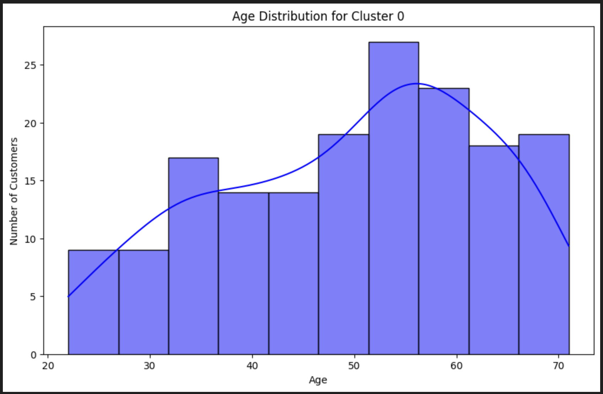
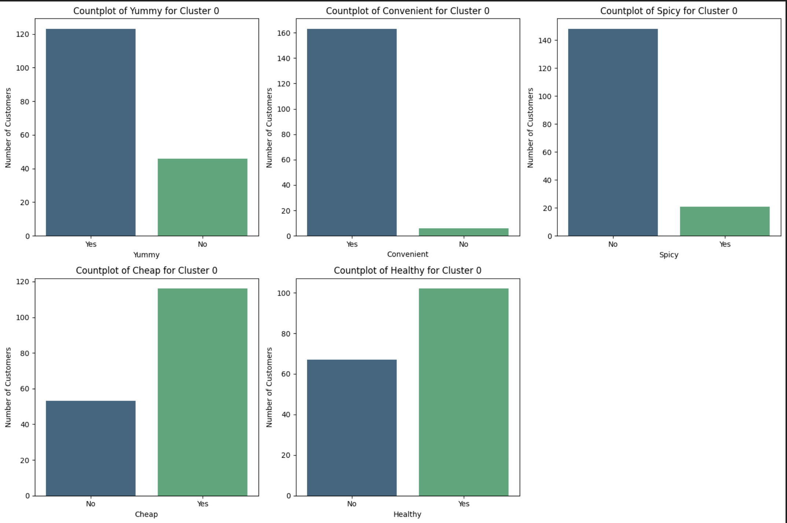

📌 McDonald’s Customer Segmentation (PCA + HDBSCAN + KMeans)

This project performs customer segmentation using the McDonald's survey dataset.
PCA is used for dimensionality reduction, HDBSCAN for structure exploration, and KMeans (k=4) for final business-oriented segmentation.

🧠 Goal

Identify the highest-value customer segment and understand:

Who they are (demographic profile)

What they value (food preferences)

How McDonald's should target them (business strategy)

🔧 Tech Stack

Python

Pandas / NumPy — data processing

Matplotlib / Seaborn — visualization

Scikit-learn — Label Encoding, StandardScaler, PCA, KMeans

HDBSCAN — density-based clustering

📊 Process Overview

EDA on Age, Gender, Like, Visit Frequency

Encoding + Standardization of categorical preference features

PCA (11 → 5 components, explaining ~70% variance)

HDBSCAN to inspect natural density patterns

KMeans (k=4) for final segmentation

Target Segment Identification using Like_score + VisitFrequency_score

Cluster 0 Persona + Preference Visualization

Business Recommendation

🎯 Target Segment (Cluster 0)

Who:
Mainly 50–60-year-old males, frequent visitors with strong brand affinity.

What they value:
Prefer tasty, convenient, affordable, and relatively healthy food, especially non-spicy items.

💡 Business Strategy (Short Version)

Focus on fast, convenient, value-oriented meals tailored to this segment’s taste: non-spicy comfort foods, simple low-oil options, and loyalty-based promotions to reinforce frequent visits. Marketing should highlight convenience and consistent quality.

📥 Clone the Repository

To download this project to your local machine, run the following command in your terminal:
# Clone the McDonald's Customer Segmentation project to your local machine
git clone https://github.com/Eriq7/Mcdonalds-Customers-Segmentation.git
cd Mcdonalds-Customers-Segmentation

