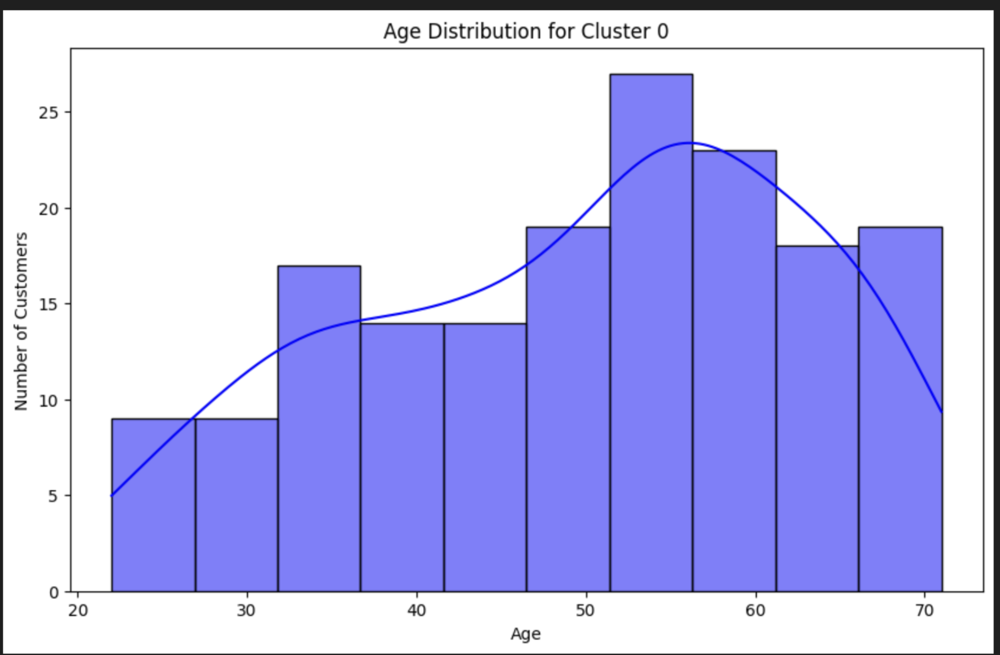
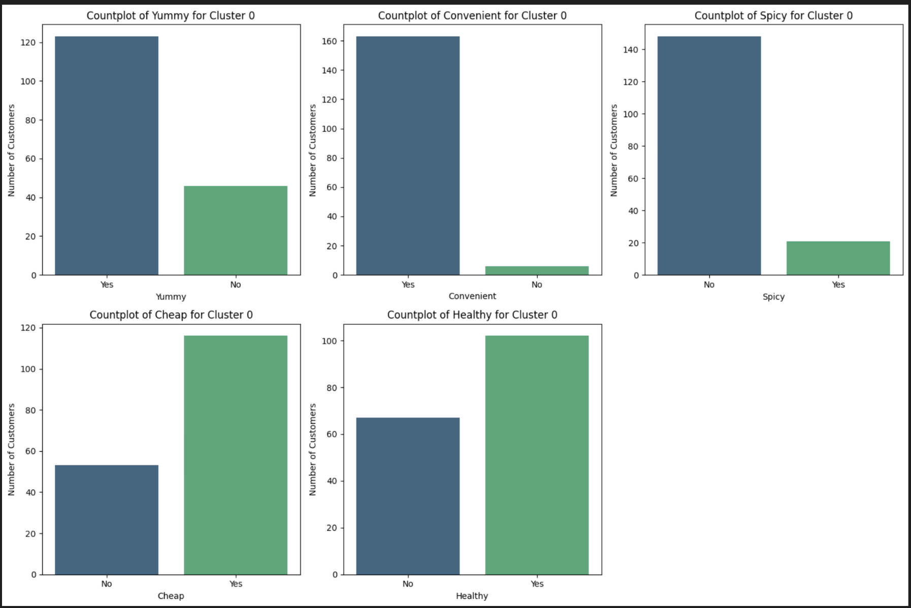

# 🍟 McDonald's Customer Segmentation (PCA + HDBSCAN + KMeans)

This project performs customer segmentation using the McDonald's survey dataset. PCA is used for dimensionality reduction, HDBSCAN for structure exploration, and **KMeans (k = 4)** for final, business‑oriented segmentation.

---

## 🧠 Goal

Identify the **highest‑value customer segment** and understand:

- **Who they are** (demographic profile)  
- **What they value** (food preferences)  
- **How McDonald's should target them** (business strategy)

---

## 🔧 Tech Stack

- **Python**
- **Pandas / NumPy** — data processing  
- **Matplotlib / Seaborn** — visualization  
- **Scikit‑learn** — Label Encoding, StandardScaler, PCA, KMeans  
- **HDBSCAN** — density‑based clustering for structure discovery  

---

## 📊 Process Overview

1. Exploratory Data Analysis (Age, Gender, Like, VisitFrequency)  
2. Label Encoding + Standardization  
3. PCA (11 → 5 components, ~70% variance explained)  
4. HDBSCAN to inspect natural density clusters  
5. KMeans (k = 4) final segmentation  
6. Target segment identification using Like_score + VisitFrequency_score  
7. Cluster 0 persona + preference visualization  
8. Business recommendation  

---

## 🎯 Target Segment (Cluster 0)

**Who:**  
Mostly **50–60‑year‑old males**, frequent visitors with strong brand affinity.


**What they value:**  
Prefer **tasty, convenient, affordable, and relatively healthy food**, especially **non‑spicy options**.


---

## 💡 Business Strategy (Short Version)

Focus on **fast, convenient, value‑oriented meals** tailored to this segment’s taste:  
non‑spicy comfort foods, simple low‑oil options, and loyalty‑based promotions to reward frequent visitors.  
Marketing should highlight **convenience + consistent quality**.

---

## 📥 Clone the Repository

Copy and paste this into your terminal to download the project:

```
git clone https://github.com/Eriq7/Mcdonalds-Customers-Segmentation.git
cd Mcdonalds-Customers-Segmentation
```

---

